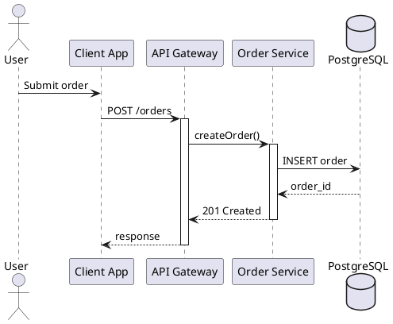

# Diagram Rules

Use these rules when authoring or reviewing PlantUML diagrams for reports and technical documents.

## Choose The Right Diagram

Use a sequence diagram when the reader needs:

- call order across services or modules
- request and response timing
- retries, branching responses, callbacks, or async hops
- activation periods and responsibility handoff

Use an activity diagram when the reader needs:

- business logic with branches and merges
- approval and rejection paths
- compensation or rollback behavior
- a workflow rather than a message exchange

Use a component diagram when the reader needs:

- service boundaries
- provided and required interfaces
- ownership of responsibilities
- external system integration points

Use a deployment diagram when the reader needs:

- runtime nodes and environments
- where workloads actually run
- gateways, queues, databases, and network boundaries

Do not force a sequence diagram when a structural or workflow view explains the point faster.

## Quality Rules

- keep names stable, specific, and business-relevant
- show only the messages or relations required by the narrative
- use activation bars when they clarify who is actively processing work
- use `alt`, `opt`, `loop`, `par`, and `group` only when they match real behavior
- keep arrows and labels concise
- place notes only where hidden assumptions matter
- ensure the diagram title matches the scenario, not the subsystem name
- split a diagram when it has more than one main story

## Modern Styling

Prefer CSS-style `style` blocks or `!theme` for modern diagrams. Keep `skinparam` for compatibility and light-touch tweaks.

Use this restrained prelude when you need a neutral, professional default:

Use `!theme` when the document needs a coherent look quickly. Keep themes restrained for professional documents.

## Sequence Diagram Pattern

Prefer a sequence diagram skeleton like this:

## Common Anti-Patterns

- generic participants such as `Service A` and `Service B`
- long method-signature text on arrows
- mixing topology and runtime call flow into one diagram
- using color to rescue a crowded diagram
- adding notes that repeat the message text

## Markdown Integration

- keep captions near the rendered image location
- use relative `images/...` paths in Markdown output
- preserve image order across the report
- keep the source `plantuml` blocks or `.puml` files when future edits are likely
